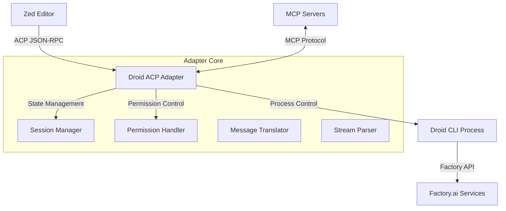
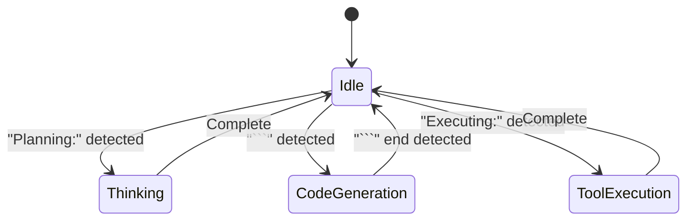
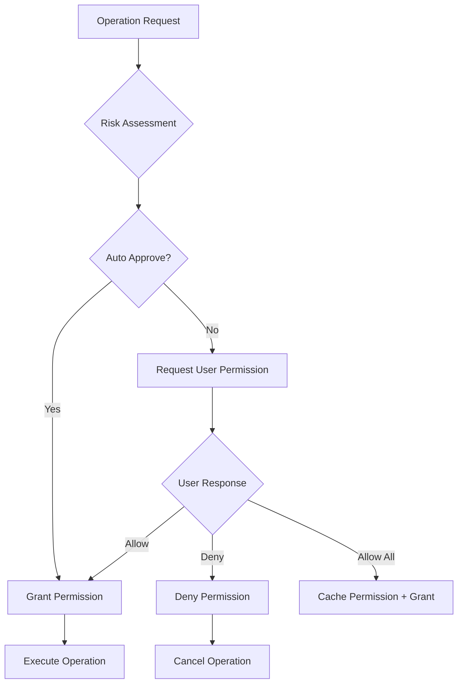

# 設計書

## 概要

本設計書では、Factory.ai の Droid AI エージェントを Agent Client Protocol (ACP) に対応させるアダプターの技術設計を定義します。段階的アプローチを採用し、TypeScript での MVP 実装から始めて、その後 Rust での本格実装に移行する戦略を取ります。

## アーキテクチャ

### システム構成図



### 段階的実装戦略

#### Phase 1: TypeScript MVP (4-6週間)
- **目標**: 基本的な ACP 通信と Droid CLI 統合
- **技術スタック**: Node.js + TypeScript + `@zed-industries/agent-client-protocol`
- **成果物**: 動作する MVP、基本的なファイル操作、権限管理

#### Phase 2: Rust 本格実装 (6-8週間)
- **目標**: 高性能、メモリ安全、プロダクション品質
- **技術スタック**: Rust + Tokio + `agent-client-protocol` crate
- **成果物**: 最適化されたアダプター、高度な機能、配布パッケージ

## コンポーネント設計

### 1. メインアダプター (DroidACPAdapter)

#### TypeScript 実装
```typescript
interface DroidACPAdapter {
  // ライフサイクル管理
  start(): Promise<void>
  stop(): Promise<void>
  
  // ACP コネクション
  connection: AgentSideConnection
  
  // コンポーネント
  droidManager: DroidProcessManager
  sessionManager: SessionManager
  permissionHandler: PermissionHandler
  messageTranslator: MessageTranslator
  streamParser: StreamParser
}
```

#### Rust 実装
```rust
pub struct DroidACPAdapter {
    /// ACP接続
    connection: Arc<AgentSideConnection>,
    
    /// Droidプロセスマネージャー
    droid_manager: Arc<DroidProcessManager>,
    
    /// セッションマネージャー
    session_manager: Arc<RwLock<SessionManager>>,
    
    /// 権限ハンドラー
    permission_handler: Arc<PermissionHandler>,
    
    /// 設定
    config: AdapterConfig,
}
```### 2.
 Droid プロセス管理 (DroidProcessManager)

#### 責務
- Droid CLI プロセスの起動・停止・監視
- 標準入出力を通じた通信
- プロセス健全性チェックと自動再起動
- 出力のリアルタイムストリーミング

#### TypeScript 実装
```typescript
class DroidProcessManager {
  private process: ChildProcess | null = null
  private inputStream: Writable
  private outputStream: Readable
  
  async spawn(config: DroidConfig): Promise<void>
  async kill(): Promise<void>
  async restart(): Promise<void>
  
  send(command: string): Promise<void>
  onOutput(callback: (data: string) => void): void
  
  isReady(): boolean
  getStatus(): ProcessStatus
}
```

### 3. ストリームパーサー (StreamParser)

#### 責務
- Droid CLI の出力を解析
- 状態遷移の管理（idle → thinking → code_generation → tool_execution）
- コードブロック、ツール実行、エラーの検出
- ACP 形式への変換

#### 状態遷移図


#### TypeScript 実装
```typescript
class DroidStreamParser extends EventEmitter {
  private buffer: string = ''
  private state: ParserState = 'idle'
  
  parse(chunk: string): void {
    this.buffer += chunk
    this.processBuffer()
  }
  
  private detectOutputType(): void
  private parseThinkingOutput(): void
  private parseCodeOutput(): void
  private parseToolOutput(): void
}
```

### 4. セッション管理 (SessionManager)

#### 責務
- セッションの作成・管理・削除
- セッションコンテキストの保存
- 複数セッションの並行処理
- セッション状態の追跡

#### データモデル
```typescript
interface Session {
  id: string
  createdAt: Date
  updatedAt: Date
  context: SessionContext
  state: SessionState
  history: Message[]
}

interface SessionContext {
  workingDirectory: string
  openFiles: string[]
  activeFile?: string
  mcpServers?: MCPServerInfo[]
}

enum SessionState {
  Active = 'active',
  Thinking = 'thinking',
  ExecutingTool = 'executing_tool',
  WaitingForPermission = 'waiting_for_permission',
  Idle = 'idle'
}
```

### 5. 権限管理 (PermissionHandler)

#### リスクレベル定義
```typescript
enum RiskLevel {
  LOW = 'low',      // ファイル読み取り、情報取得
  MEDIUM = 'medium', // ファイル書き込み、ローカル実行
  HIGH = 'high'     // git push、システム変更、外部API呼び出し
}

const OPERATION_RISK_MAP = {
  'file_read': RiskLevel.LOW,
  'file_write': RiskLevel.MEDIUM,
  'git_commit': RiskLevel.MEDIUM,
  'git_push': RiskLevel.HIGH,
  'terminal_exec': RiskLevel.HIGH,
  'delete_file': RiskLevel.HIGH
}
```

#### 権限フロー


### 6. メッセージ変換 (MessageTranslator)

#### 責務
- ACP メッセージから Droid CLI コマンドへの変換
- Droid CLI 出力から ACP レスポンスへの変換
- コンテキスト参照の処理（@file:, @symbol: など）
- エラーメッセージの標準化

#### TypeScript 実装
```typescript
class MessageTranslator {
  // ACP → Droid
  translatePrompt(prompt: ACPPrompt): DroidCommand {
    const enrichedPrompt = this.processReferences(prompt)
    return this.formatForDroid(enrichedPrompt)
  }
  
  translateFileOperation(op: FileOperation): DroidCommand
  
  // Droid → ACP
  parseResponse(output: string): ACPResponse
  parseToolCall(output: string): ToolCall
  parseError(output: string): ACPError
  
  private processReferences(prompt: ACPPrompt): string
}
```

## データモデル

### 設定 (AdapterConfig)
```typescript
interface AdapterConfig {
  // Droid CLI設定
  droidPath: string                    // デフォルト: 'droid'
  workingDirectory: string             // デフォルト: process.cwd()
  
  // 認証設定
  apiKey?: string                      // Factory.ai APIキー
  authMethod: 'token' | 'browser' | 'auto'
  
  // 権限設定
  autoApproveLevel?: RiskLevel         // 自動承認レベル
  requireConfirmation: boolean         // 確認必須モード
  
  // パフォーマンス設定
  streamBufferSize: number             // デフォルト: 1024
  responseTimeout: number              // デフォルト: 30000ms
  
  // デバッグ設定
  debug: boolean
  logLevel: 'error' | 'warn' | 'info' | 'debug'
}
```

### ACP プロトコル実装

#### 初期化フロー
```typescript
async function handleInitialize(params: InitializeParams): Promise<InitializeResponse> {
  return {
    protocolVersion: 1,
    agentCapabilities: {
      loadSession: true,
      promptCapabilities: {
        image: false,
        audio: false,
        embeddedContext: true
      },
      mcpCapabilities: {
        http: true,
        sse: false
      }
    },
    authMethods: [
      {
        id: 'factory-api-key',
        displayName: 'Factory.ai API Key'
      },
      {
        id: 'factory-browser',
        displayName: 'Factory.ai Browser Authentication'
      }
    ]
  }
}
```

#### 認証フロー
```typescript
async function handleAuthenticate(params: AuthenticateParams): Promise<AuthenticateResponse> {
  const token = process.env.FACTORY_API_KEY || params.credentials?.apiKey
  
  if (!token) {
    return {
      status: 'pending',
      authUrl: 'https://app.factory.ai/auth/cli',
      message: 'Please authenticate in your browser and set FACTORY_API_KEY'
    }
  }
  
  await validateFactoryToken(token)
  return { status: 'authenticated' }
}
```

## エラーハンドリング

### エラーコード定義
```typescript
enum ErrorCode {
  // JSON-RPC標準エラー
  PARSE_ERROR = -32700,
  INVALID_REQUEST = -32600,
  METHOD_NOT_FOUND = -32601,
  
  // カスタムエラー
  DROID_NOT_AVAILABLE = -32001,
  AUTHENTICATION_FAILED = -32002,
  PERMISSION_DENIED = -32003,
  SESSION_NOT_FOUND = -32004,
  FACTORY_API_ERROR = -32005,
  PROCESS_ERROR = -32006,
  TIMEOUT_ERROR = -32007
}
```

### エラー処理戦略
```typescript
class ErrorHandler {
  handleError(error: any): ACPError {
    if (error.code === 'ENOENT' && error.path?.includes('droid')) {
      return {
        code: ErrorCode.DROID_NOT_AVAILABLE,
        message: 'Droid CLI not found. Please install it first.',
        data: { 
          installUrl: 'https://docs.factory.ai/cli/install',
          suggestedPath: '/usr/local/bin/droid'
        }
      }
    }
    
    if (error.message?.includes('authentication')) {
      return {
        code: ErrorCode.AUTHENTICATION_FAILED,
        message: 'Factory.ai authentication failed',
        data: { 
          authUrl: 'https://app.factory.ai/auth',
          envVar: 'FACTORY_API_KEY'
        }
      }
    }
    
    // デフォルトエラー
    return {
      code: ErrorCode.INTERNAL_ERROR,
      message: error.message || 'Unknown error occurred',
      data: { stack: error.stack }
    }
  }
}
```#
# テスト戦略

### ユニットテスト
- **カバレッジ目標**: > 80%
- **フレームワーク**: Jest (TypeScript), cargo test (Rust)
- **モック**: Droid CLI プロセス、ACP 通信、ファイルシステム

### 統合テスト
- **E2E シナリオ**: 完全な対話フロー
- **実際の Droid CLI**: テスト環境での実行
- **エラーケース**: 異常終了、ネットワークエラー、権限拒否

### パフォーマンステスト
- **負荷テスト**: 複数セッション同時実行
- **メモリリークテスト**: 長時間実行
- **レイテンシ測定**: ストリーミング遅延

## 配布戦略

### Phase 1: TypeScript MVP
- **npm パッケージ**: `@community/droid-acp-adapter`
- **GitHub Releases**: バイナリ配布（pkg でパッケージ化）
- **Docker イメージ**: コンテナ実行環境

### Phase 2: Rust 実装
- **Cargo クレート**: `droid-acp-adapter`
- **GitHub Releases**: 各 OS 用バイナリ
- **Homebrew Formula**: macOS 用パッケージマネージャー

## セキュリティ考慮事項

### 権限管理
- **最小権限の原則**: 必要最小限の権限のみ付与
- **操作ログ**: 全ての危険な操作をログに記録
- **サンドボックス**: 可能な限りプロセス分離

### 認証
- **API キー保護**: 環境変数での管理を推奨
- **トークン検証**: Factory.ai API での定期的な検証
- **セッション管理**: 適切なセッション有効期限

### 入力検証
- **パス検証**: ディレクトリトラバーサル攻撃の防止
- **コマンド検証**: インジェクション攻撃の防止
- **ファイルサイズ制限**: DoS 攻撃の防止

## パフォーマンス最適化

### TypeScript 実装
- **ストリーミング**: Node.js Streams API の活用
- **非同期処理**: Promise/async-await の適切な使用
- **メモリ管理**: バッファサイズの制限とガベージコレクション

### Rust 実装
- **ゼロコピー**: Bytes クレートでのメモリ効率化
- **並行処理**: Tokio での非同期 I/O
- **メモリプール**: バッファの再利用

## 監視とロギング

### ログレベル
- **ERROR**: 致命的なエラー、プロセス停止
- **WARN**: 警告、リトライ可能なエラー
- **INFO**: 重要なイベント、セッション開始/終了
- **DEBUG**: 詳細な実行情報、開発時のみ

### メトリクス
- **レスポンス時間**: 各操作の実行時間
- **メモリ使用量**: プロセス単位での監視
- **エラー率**: 操作失敗の割合
- **セッション数**: 同時実行セッション数

## 今後の拡張計画

### Phase 3: 高度な機能 (3-4ヶ月後)
- **プラグインシステム**: カスタム機能の追加
- **マルチエージェント**: 複数 AI エージェントの協調
- **ワークフロー**: 複雑なタスクの自動化

### Phase 4: エンタープライズ機能 (6ヶ月後)
- **チーム共有**: セッションとコンテキストの共有
- **監査ログ**: コンプライアンス対応
- **ロールベースアクセス**: 組織内での権限管理