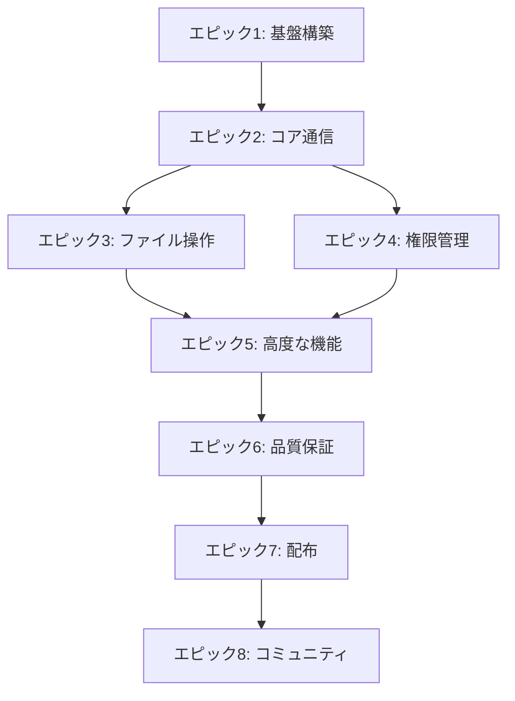

# Droid ACPアダプター プロダクトバックログ

## プロダクトビジョン
Factory.aiのDroidをあらゆるACP対応エディタから利用可能にし、開発者の生産性を最大化する高性能なオープンソースアダプターを提供する。

## 優先度の定義

- **P0**: MVP必須機能（なければ動作しない）
- **P1**: 基本機能（一般的な使用に必要）
- **P2**: 拡張機能（UX向上）
- **P3**: Nice to Have（将来的な改善）

## エピック構成

📦 エピック1: 基盤構築とプロジェクトセットアップ
### 🎯 ゴール
開発環境を整備し、基本的なプロジェクト構造を確立する

| ID | ユーザーストーリー | 受け入れ基準 | 優先度 | ストーリーポイント | 実装言語 |
|---|---|---|---|---|---|
| US-001 | 開発者として、Rustプロジェクトの基本構造を設定したい | - Cargo.tomlが正しく設定される - 基本的なモジュール構造が作成される - ビルドが成功する | P0 | 3 | Rust |
| US-002 | 開発者として、TypeScriptプロジェクトの基本構造も並行して設定したい | - package.jsonが設定される - TypeScript設定が完了 - ESLint/Prettier設定 | P0 | 3 | TS |
| US-003 | 開発者として、CI/CDパイプラインを設定したい | - GitHub Actionsが設定される - 自動テストが動作 - リンターが動作 | P0 | 5 | 両方 |
| US-004 | 開発者として、開発環境のDockerコンテナを用意したい | - Dockerfileが作成される - docker-composeで起動可能 - 開発ツールが含まれる | P1 | 3 | - |
| US-005 | 開発者として、ログシステムを実装したい | - tracingクレート設定（Rust） - winston設定（TS） - ログレベル制御可能 | P0 | 2 | 両方 |
📋 タスク詳細

US-001: Rustプロジェクト基本構造

技術タスク:

 Cargo.toml作成と依存関係定義
 src/ディレクトリ構造作成
 main.rsとlib.rs作成
 基本的なエラー型定義
 Makefileまたはjustfile作成

Definition of Done:

cargo build --releaseが成功
cargo testが実行可能
cargo clippyでエラーなし

📦 エピック2: ACPプロトコルコア実装
### 🎯 ゴール
ACPプロトコルの基本的な通信を実現し、Zedとの接続を確立する

| ID | ユーザーストーリー | 受け入れ基準 | 優先度 | ストーリーポイント | 実装言語 |
|---|---|---|---|---|---|
| US-006 | エディタ利用者として、アダプターを起動できるようにしたい | - プロセスが正常起動 - stdin/stdout通信確立 - JSON-RPC形式で応答 | P0 | 5 | 両方 |
| US-007 | エディタ利用者として、初期化ハンドシェイクを完了したい | - initializeメソッド実装 - ケイパビリティ交換 - プロトコルバージョン確認 | P0 | 5 | 両方 |
| US-008 | エディタ利用者として、Factory.ai認証を完了したい | - authenticateメソッド実装 - APIキー認証 - ブラウザ認証フォールバック | P0 | 8 | 両方 |
| US-009 | エディタ利用者として、セッションを作成したい | - session/newメソッド実装 - セッションID生成 - コンテキスト保存 | P0 | 5 | 両方 |
| US-010 | エディタ利用者として、基本的なプロンプトを送信したい | - session/promptメソッド実装 - メッセージ送受信 - エラーハンドリング | P0 | 8 | 両方 |
📋 タスク詳細

US-007: 初期化ハンドシェイク

技術タスク:

 InitializeParamsの型定義
 InitializeResponseの型定義
 ケイパビリティ構造体実装
 バージョンネゴシエーション
 MCPサーバー情報の保存

Definition of Done:

Zedから接続時に初期化成功
ケイパビリティが正しく返される
エラー時の適切なレスポンス

📦 エピック3: Droidプロセス管理とストリーミング
### 🎯 ゴール
Droid CLIとの通信を確立し、リアルタイムストリーミングを実現

| ID | ユーザーストーリー | 受け入れ基準 | 優先度 | ストーリーポイント | 実装言語 |
|---|---|---|---|---|---|
| US-011 | 開発者として、Droid CLIプロセスを管理したい | - プロセス起動/停止 - 健全性チェック - 自動再起動 | P0 | 8 | 両方 |
| US-012 | エディタ利用者として、Droidの出力をリアルタイムで見たい | - ストリーミングパーサー実装 - チャンク送信 - バッファ管理 | P0 | 13 | 両方 |
| US-013 | エディタ利用者として、Droidの思考過程を見たい | - プランニング検出 - ステップ表示 - 進捗通知 | P1 | 5 | 両方 |
| US-014 | エディタ利用者として、コード生成を確認したい | - コードブロック検出 - シンタックスハイライト情報 - 言語タイプ検出 | P1 | 5 | 両方 |
| US-015 | 開発者として、パーサーの状態遷移を管理したい | - 状態機械実装 - エラーリカバリ - タイムアウト処理 | P1 | 8 | 両方 |
📋 タスク詳細

US-012: リアルタイムストリーミング

技術タスク:

 StreamParserトレイト定義
 チャンク分割ロジック
 session/updateノーティフィケーション
 バックプレッシャー制御
 メモリ効率的なバッファリング

パフォーマンス要件:

レイテンシ < 50ms
メモリ使用量 < 10MB/セッション
CPU使用率 < 5%（アイドル時）

📦 エピック4: ファイル操作と差分管理
### 🎯 ゴール
ファイルの読み書きと差分表示機能を実装

| ID | ユーザーストーリー | 受け入れ基準 | 優先度 | ストーリーポイント | 実装言語 |
|---|---|---|---|---|---|
| US-016 | エディタ利用者として、ファイルを読み取りたい | - readFileメソッド実装 - パス検証 - エラーハンドリング | P0 | 3 | 両方 |
| US-017 | エディタ利用者として、ファイルを書き込みたい | - writeFileメソッド実装 - アトミック書き込み - バックアップ作成 | P0 | 5 | 両方 |
| US-018 | エディタ利用者として、変更差分を確認したい | - diff生成 - ハイライト情報 - 行番号表示 | P0 | 8 | 両方 |
| US-019 | エディタ利用者として、複数ファイルの一括変更を確認したい | - マルチファイルdiff - 変更サマリー - 一括承認/拒否 | P1 | 8 | 両方 |
| US-020 | エディタ利用者として、ファイル操作を取り消したい | - アンドゥ機能 - 履歴管理 - ロールバック | P2 | 5 | 両方 |

📦 エピック5: 権限管理とセキュリティ
### 🎯 ゴール
安全な操作のための権限管理システムを実装

| ID | ユーザーストーリー | 受け入れ基準 | 優先度 | ストーリーポイント | 実装言語 |
|---|---|---|---|---|---|
| US-021 | エディタ利用者として、危険な操作前に確認したい | - permission/requestメソッド - リスクレベル表示 - 確認ダイアログ | P0 | 8 | 両方 |
| US-022 | エディタ利用者として、権限を記憶させたい | - 権限キャッシュ - "今後も許可"オプション - セッション永続化 | P1 | 5 | 両方 |
| US-023 | エディタ利用者として、自動承認レベルを設定したい | - 設定UI - 環境変数サポート - リスクレベル別制御 | P1 | 3 | 両方 |
| US-024 | 管理者として、操作ログを監査したい | - 監査ログ出力 - タイムスタンプ - 操作者情報 | P2 | 5 | 両方 |
| US-025 | 開発者として、サンドボックス環境で実行したい | - コンテナ分離 - リソース制限 - ネットワーク制御 | P3 | 13 | 両方 |

📦 エピック6: 高度な機能とMCP統合
### 🎯 ゴール
MCPツール統合やターミナル実行などの高度な機能を実装

| ID | ユーザーストーリー | 受け入れ基準 | 優先度 | ストーリーポイント | 実装言語 |
|---|---|---|---|---|---|
| US-026 | エディタ利用者として、MCPツールを使用したい | - MCPサーバー接続 - ツール呼び出し - レスポンス処理 | P2 | 13 | 両方 |
| US-027 | エディタ利用者として、ターミナルコマンドを実行したい | - コマンド実行 - 出力キャプチャ - インタラクティブ入力 | P2 | 8 | 両方 |
| US-028 | エディタ利用者として、Git操作を実行したい | - git commit/push - ブランチ操作 - コンフリクト解決 | P2 | 8 | 両方 |
| US-029 | エディタ利用者として、プロジェクト全体をスキャンしたい | - ディレクトリトラバース - ファイルフィルタ - 並列処理 | P2 | 5 | 両方 |
| US-030 | エディタ利用者として、カスタムコマンドを定義したい | - コマンド登録 - パラメータ定義 - ヘルプ生成 | P3 | 8 | 両方 |

📦 エピック7: パフォーマンス最適化
### 🎯 ゴール
高速で効率的な動作を実現

| ID | ユーザーストーリー | 受け入れ基準 | 優先度 | ストーリーポイント | 実装言語 |
|---|---|---|---|---|---|
| US-031 | 開発者として、起動時間を最小化したい | - 起動時間 < 100ms - 遅延初期化 - キャッシュ活用 | P1 | 5 | Rust |
| US-032 | 開発者として、メモリ使用量を最適化したい | - メモリプール実装 - < 20MB/セッション - リーク検出 | P1 | 8 | Rust |
| US-033 | 開発者として、大規模ファイルを効率的に処理したい | - ストリーミング処理 - 10MB+ ファイル対応 - チャンク処理 | P2 | 8 | Rust |
| US-034 | 開発者として、並行処理を最適化したい | - マルチスレッド活用 - ロックフリー実装 - 並行度制御 | P2 | 13 | Rust |
| US-035 | 開発者として、ベンチマークを自動化したい | - CI統合 - パフォーマンス回帰検出 - レポート生成 | P2 | 5 | 両方 |

📦 エピック8: テストと品質保証
### 🎯 ゴール
高品質で信頼性の高いソフトウェアを提供

| ID | ユーザーストーリー | 受け入れ基準 | 優先度 | ストーリーポイント | 実装言語 |
|---|---|---|---|---|---|
| US-036 | 開発者として、ユニットテストを網羅したい | - カバレッジ > 80% - モック実装 - 自動実行 | P0 | 8 | 両方 |
| US-037 | 開発者として、統合テストを実装したい | - E2Eシナリオ - 実際のDroid CLI使用 - エラーケース | P0 | 13 | 両方 |
| US-038 | 開発者として、プロパティベーステストを実装したい | - quickcheck/proptest - ファズテスト - 境界値テスト | P2 | 8 | Rust |
| US-039 | QAとして、手動テストケースを文書化したい | - テストケース作成 - チェックリスト - バグレポート様式 | P1 | 3 | - |
| US-040 | 開発者として、パフォーマンステストを自動化したい | - 負荷テスト - メモリリークテスト - レイテンシ測定 | P2 | 5 | 両方 |

📦 エピック9: ドキュメントとサンプル
### 🎯 ゴール
開発者が簡単に使い始められる充実したドキュメントを提供

| ID | ユーザーストーリー | 受け入れ基準 | 優先度 | ストーリーポイント | 実装言語 |
|---|---|---|---|---|---|
| US-041 | 新規利用者として、クイックスタートガイドが欲しい | - 5分で動作確認 - スクリーンショット付き - トラブルシューティング | P0 | 5 | - |
| US-042 | 開発者として、APIリファレンスが欲しい | - 全メソッド文書化 - 型定義説明 - サンプルコード | P0 | 8 | - |
| US-043 | 開発者として、アーキテクチャ文書が欲しい | - システム図 - データフロー - 設計判断の理由 | P1 | 5 | - |
| US-044 | 利用者として、設定例が欲しい | - 各エディタ設定 - 環境変数一覧 - ベストプラクティス | P1 | 3 | - |
| US-045 | 開発者として、コントリビューションガイドが欲しい | - 開発環境構築 - PRガイドライン - コーディング規約 | P1 | 3 | - |

📦 エピック10: 配布とリリース
### 🎯 ゴール
様々な環境で簡単にインストール可能な配布方法を提供

| ID | ユーザーストーリー | 受け入れ基準 | 優先度 | ストーリーポイント | 実装言語 |
|---|---|---|---|---|---|
| US-046 | 利用者として、npm経由でインストールしたい | - npm公開 - 依存関係解決 - postinstall処理 | P0 | 3 | TS |
| US-047 | 利用者として、Cargo経由でインストールしたい | - crates.io公開 - cargo-binstall対応 - features設定 | P0 | 3 | Rust |
| US-048 | 利用者として、バイナリをダウンロードしたい | - GitHub Releases - 各OS用ビルド - 自動署名 | P0 | 5 | 両方 |
| US-049 | 利用者として、Homebrew経由でインストールしたい | - Formula作成 - 自動更新 - M1/Intel対応 | P1 | 3 | - |
| US-050 | 利用者として、Docker経由で実行したい | - マルチステージビルド - 最小イメージ - docker-compose例 | P2 | 3 | - |

📦 エピック11: コミュニティとエコシステム
### 🎯 ゴール
活発なオープンソースコミュニティを構築

| ID | ユーザーストーリー | 受け入れ基準 | 優先度 | ストーリーポイント | 実装言語 |
|---|---|---|---|---|---|
| US-051 | コントリビューターとして、Issue報告したい | - Issueテンプレート - バグ/機能要望分類 - 自動ラベリング | P1 | 2 | - |
| US-052 | 利用者として、Discordで質問したい | - Discordサーバー - チャンネル構成 - FAQ bot | P2 | 3 | - |
| US-053 | 開発者として、プラグインを作成したい | - プラグインAPI - サンプルプラグイン - マーケットプレイス | P3 | 13 | 両方 |
| US-054 | 利用者として、他エディタでも使いたい | - VS Code拡張 - Neovim統合 - Emacs対応 | P3 | 21 | 両方 |
| US-055 | コミュニティとして、ロードマップを共有したい | - 公開ロードマップ - 投票機能 - 進捗追跡 | P2 | 3 | - |

## 🔄 スプリント計画案

### スプリント1-2: 基盤構築（2週間）
- **ゴール**: 開発環境整備とプロジェクト立ち上げ
- **ストーリー**: US-001〜US-005
- **成果物**: ビルド可能なプロジェクト骨格

### スプリント3-4: ACPコア実装（2週間）
- **ゴール**: Zedとの基本的な接続確立
- **ストーリー**: US-006〜US-010
- **成果物**: 初期化と認証が動作するアダプター

### スプリント5-6: Droid統合（2週間）
- **ゴール**: Droid CLIとの通信実現
- **ストーリー**: US-011〜US-015
- **成果物**: 基本的な対話が可能なMVP

### スプリント7-8: ファイル操作（2週間）
- **ゴール**: コード編集機能の実装
- **ストーリー**: US-016〜US-020
- **成果物**: ファイル編集可能なアダプター

### スプリント9-10: 権限とテスト（2週間）
- **ゴール**: セキュリティと品質の確保
- **ストーリー**: US-021〜US-025, US-036〜US-037
- **成果物**: プロダクション品質のアダプター

### スプリント11-12: 公開準備（2週間）
- **ゴール**: v1.0リリース
- **ストーリー**: US-041〜US-050
- **成果物**: 公開されたパッケージとドキュメント

## 📊 メトリクスとKPI

### 開発メトリクス
- **ベロシティ**: 各スプリント20-30ポイント目標
- **バグ密度**: < 1バグ/1000行
- **テストカバレッジ**: > 80%
- **ビルド時間**: < 3分

### 品質メトリクス
- **起動時間**: < 100ms（Rust）、< 500ms（TS）
- **メモリ使用量**: < 20MB/セッション
- **レスポンス時間**: < 50ms（95パーセンタイル）
- **エラー率**: < 0.1%

### コミュニティメトリクス
- **GitHub Stars**: 100+ (3ヶ月)
- **月間ダウンロード**: 1000+
- **アクティブコントリビューター**: 5+
- **Issue解決時間**: < 7日（平均）

## 🎯 リリース計画

### v0.1.0 - MVP（スプリント6後）
- 基本的な対話機能
- Zed対応のみ
- 限定的なファイル操作

### v0.5.0 - ベータ（スプリント10後）
- 完全なファイル操作
- 権限管理
- 基本的なMCP統合

### v1.0.0 - 正式リリース（スプリント12後）
- プロダクション品質
- 完全なドキュメント
- 複数エディタ対応

### v1.5.0 - 拡張版（3ヶ月後）
- 高度な機能
- プラグインシステム
- エンタープライズ機能

### v2.0.0 - 次世代版（6ヶ月後）
- Factory.ai公式統合
- AI機能拡張
- マルチエージェント対応

## 📝 リスクレジスタ

| リスク | 影響 | 発生確率 | 軽減策 |
|---|---|---|---|
| Droid CLI仕様変更 | 高 | 中 | APIバージョニング、後方互換性維持 |
| Factory.ai非協力 | 高 | 低 | リバースエンジニアリング、コミュニティ主導 |
| パフォーマンス問題 | 中 | 中 | 早期ベンチマーク、プロファイリング |
| 採用率低迷 | 中 | 中 | 積極的なマーケティング、デモ動画 |
| セキュリティ脆弱性 | 高 | 低 | セキュリティ監査、権限管理徹底 |

## 🤝 ステークホルダー

- **プロダクトオーナー**: コミュニティリーダー
- **スクラムマスター**: ローテーション制
- **開発チーム**: オープンソースコントリビューター
- **利用者**: Zedユーザー、Droidユーザー
- **パートナー**: Zed Industries（希望）、Factory.ai（希望）

## 📅 スプリントイベント

### スプリント計画（各スプリント初日）
- **時間**: 2時間
- **参加者**: 開発チーム全員
- **成果物**: スプリントバックログ

### デイリースクラム
- **時間**: 15分（非同期Discord/GitHub）
- **形式**: 進捗共有、障害報告

### スプリントレビュー（各スプリント最終日）
- **時間**: 1時間
- **形式**: デモ動画、ライブストリーム
- **成果物**: フィードバック収集

### レトロスペクティブ（レビュー後）
- **時間**: 1時間
- **形式**: オンラインボード
- **成果物**: 改善アクションアイテム